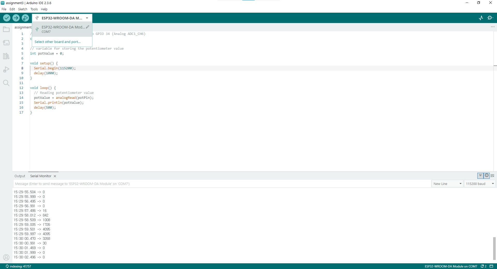

# IoT25-HW03-ESP32-Read-Potentiometer-Value

## Screenshots of working project


## Excuting video


## Source code
```cpp
// Potentiometer is connected to GPIO 34 (Analog ADC1_CH6) 
const int potPin = 34;

// variable for storing the potentiometer value
int potValue = 0;

void setup() {
  Serial.begin(115200);
  delay(1000);
}

void loop() {
  // Reading potentiometer value
  potValue = analogRead(potPin);
  Serial.println(potValue);
  delay(500);
}
